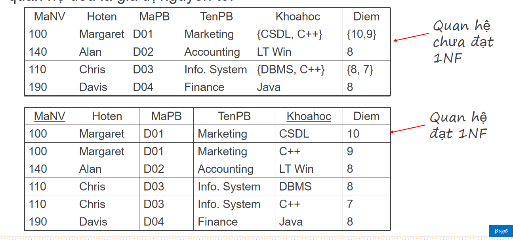
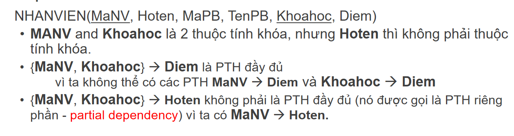

1. Some Terminology about db

   - Database vs DBMS vs Database System
     - A structured collection of data
     - A software that manages the database
     - A combination of database and DBMS
   - Metadata
     - Data about data, e.g. column names, data types, constraints
   - properties, attributes vs tuple, record
   - super key, candidate key, primary key, foreign key

2. SQL basics

- Query in one table

  - Projection vs Selection
    - Projection: Selecting only the required columns
    - Selection: Filtering rows based on some condition
  - Comparison operators

    - LIKE and NOT LIKE
      - for string matching
      - '%': zero or more characters
      - "\_": exactly one character
    - IN and NOT IN

      - Used to check if a value is in a list of values

    - BETWEEN min_value AND max_value

  - Grouping and Aggregation
    - COUNT, SUM, AVG, MIN, MAX
    - GROUP BY
    - HAVING
    - Ordering: ORDER BY
  - Filtering & Sorting: WHERE, ORDER BY, LIMIT
  - Order of clauses in a query vs order of execution
    - SELECT, FROM, WHERE, GROUP BY, HAVING, ORDER BY, LIMIT (in order of writing)
    - FROM, WHERE, GROUP BY, HAVING, SELECT, ORDER BY, LIMIT (in order of execution)

- Query in multiple tables
  - Joins: INNER JOIN, LEFT JOIN, RIGHT JOIN, FULL JOIN
  - Subqueries & CTEs: WITH clause, nested SELECT
    - Comparison operators with Subqueries
      - All, ANY
      - EXISTS, NOT EXISTS
      - IN, NOT IN

3. Schema Design & Normalization

- Primary keys, foreign keys, constraints in Database
  - Primary key: A column or a set of columns that uniquely identifies a row in a table
  - Foreign key: A column or a set of columns that establishes a relationship between two tables
  - Some constraints: NOT NULL, UNIQUE, CHECK : check some condition, DEFAULT: give default value if not provided
- Relationships: one-to-one, one-to-many, many-to-many
  - One-to-one: A single record in one table is related to a single record in another table
  - One-to-many: A single record in one table is related to multiple records in another table
  - Many-to-many: Multiple records in one table are related to multiple records in another table
- Normalization: 1NF, 2NF, 3NF, BCNF

  - 1NF: Every column should have atomic values
    
  - 2NF: 1NF + No partial dependency
    
    
  - 3NF: 2NF + No transitive dependency
    

    3.1. Index

  - What is an index?
    - A data structure that improves the speed of data retrieval operations on a database table
    - Ex: A book index => Page number of a chapter
  - Types of indexes
    - primary key index
    - unique index
    - clustered index
    - non-clustered index
    - composite index
  - When to use an index?
    - Primary and foreign keys (automatically indexed).
    - Columns used in WHERE, JOIN, ORDER BY, GROUP BY, HAVING clauses.
    - Columns with high cardinality (e.g., email, phone number).
    - Frequently queried columns.
  - When not to use an index?
    - When a table has a small number of rows
    - Columns with low cardinality (e.g., gender with values 'M' or 'F').
    - Heavy write operations

4. Transactions & Concurrency

- ACID properties

  - https://www.youtube.com/watch?v=GAe5oB742dw&t=235s&ab_channel=ByteByteGo

  - atomicity, consistency, isolation, durability
    - Atomicity: All or nothing
      - Example: In a bank transfer, money must be deducted from Account A and added to Account B. If either step fails, the whole transaction must be reversed.
    - Consistency: Database should be in a consistent state before and after the transaction
      - Example: A transaction cannot leave a bank account with a negative balance (if negative balances are not allowed)
    - Isolation (No dirty read): Transactions should be isolated from each other
      - Example: If two transactions are running concurrently, one should not be able to see the intermediate state of the other
    - Durability: Once a transaction is committed, it should be permanent
      - Example: If a transaction is committed, the changes should persist even if the system crashes immediately after

- Transactions: BEGIN, COMMIT, ROLLBACK
  - BEGIN: Start a transaction
  - COMMIT: Save the changes made in the transaction
  - ROLLBACK: Undo the changes made in the transaction
  - Example:
    ```sql
    BEGIN;
    UPDATE accounts SET balance = balance - 100 WHERE account_id = 1;
    UPDATE accounts SET balance = balance + 100 WHERE account_id = 2;
    COMMIT;
    ```
    If any step fails, ROLLBACK ensures data integrity.
- Isolation levels: READ UNCOMMITTED, READ COMMITTED, REPEATABLE READ, SERIALIZABLE
  - READ UNCOMMITTED: Dirty reads, Non-repeatable reads , Phantom reads
  - READ COMMITTED: No dirty reads, Non-repeatable reads, Phantom reads
  - REPEATABLE READ: No dirty reads, No non-repeatable reads, Phantom reads
  - SERIALIZABLE: No dirty reads, No non-repeatable reads, No phantom reads
    - Non-repeatable reads: A transaction reads the same row multiple times and gets different values
    - Phantom reads: A transaction reads a set of rows multiple times and gets different rows

5. Basic stored procedures & Triggers

- Just know theory is enough
- Stored procedures: A set of SQL statements that perform a specific task
  - Advantages: Reusability, Security, Performance
  - Disadvantages: Debugging, Versioning
- Triggers: A set of SQL statements that are automatically executed when a specific event occurs
  - Types: BEFORE, AFTER, INSTEAD OF
  - Advantages: Data integrity, Security
  - Disadvantages: Performance, Debugging

6. Backend Integration

- ORM, how it work??
  JDBC / JPA / Hibernate Basics
  Using Connection Pools
  N+1 Query Problem & How to Avoid It
  Database Migration Tools (Liquibase/Flyway)
