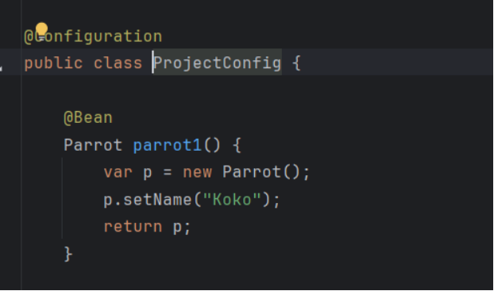
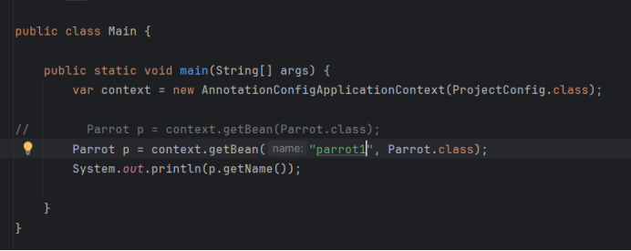
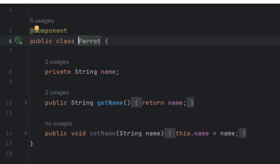
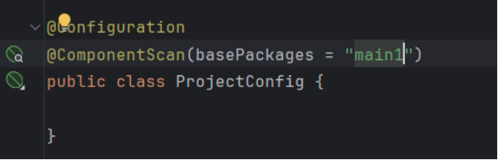
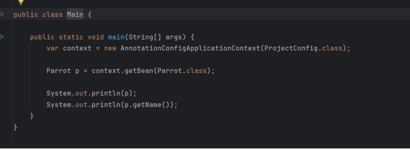
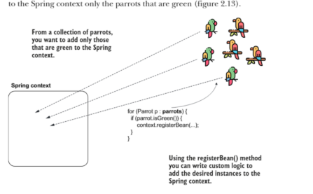
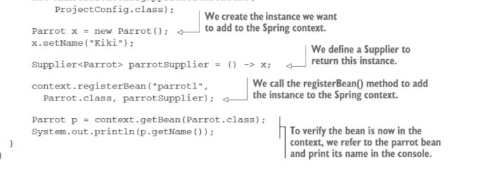
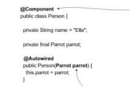
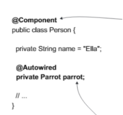

# Spring Framework Quick Reference

## 1. Spring Anatomy

### IoC (Inversion of Control)

- What it is & why it matters
  - Normal app: the application controls the flow of execution
  - IoC: the framework controls the flow of execution
  - => Makes the application more modular, testable, and maintainable
- `ApplicationContext` vs. `BeanFactory`

### DI (Dependency Injection)

- DI: mean "injecting dependencies" from spring context to the class

### AOP (Aspect-Oriented Programming)

- Key concepts (`JoinPoint`, `Advice`, `Pointcut`, `Aspect`, `Proxy`)
- Spring AOP vs. AspectJ
- Use cases (logging, transactions, security)

### Spring Context

- `ApplicationContext` vs. `WebApplicationContext`
- Profile-based configuration
- Event handling in Spring

---

## 2. Bean Management

### How to add bean to context

- Using Bean annotations (`@Bean`)

  - Add `@Bean` method in `@Configuration` class
    
  - Add `@Configuration` class in context
    

- Using stereotype annotations (`@ComponentScan`, `@SpringBootApplication`)

  - Use `@Component` or`@Service`, `@Repository`, `@Controller` to classes
    
  - Add `@ComponentScan` or `@SpringBootApplication` in context
    
  - main class is the same
    

- Using programmatic configuration
- When u want to add some bean depend on the situation, condition
- Using registerBean() method
  
  

### How to get bean from context

- Autowired
  - Constructor
    
  - Field Injection (could not make final => not recommended)
    
  - Setter Injection ( Rarely use, or even not)
- Circular dependency resolution
  - Happened when 2 bean need each other to create
- `@Autowired`, `ApplicationContext.getBean()`
- `@Qualifier` and `@Primary`

### Bean Scopes

- `Singleton`, `Prototype`, `Request`, `Session`, `Application`

### Bean Lifecycle

- Initialization & destruction (`@PostConstruct`, `@PreDestroy`, `InitializingBean`, `DisposableBean`)
- `BeanPostProcessor` and `BeanFactoryPostProcessor`

---

## 3. Spring AOP

- Proxy-based AOP (`JDK Dynamic Proxy` vs. `CGLIB`)
- Custom annotations for aspects
- Ordering aspects
- Handling exceptions in aspects

---

## 4. Spring Configuration & Properties

- `@Value`, `@ConfigurationProperties`
- Externalizing configuration (`YAML`, `.properties`, `Environment Variables`)
- Profiles (`@Profile`, `spring.profiles.active`)

---

## 5. Spring Transactions

- `@Transactional` (Propagation, Isolation, ReadOnly)
- Transaction Rollback handling
- Programmatic vs. Declarative Transactions

---

## 6. Spring Data & Persistence

- Spring JDBC (`JdbcTemplate`)
- Spring ORM (`JPA`, `Hibernate`)
- Spring Data JPA
- Repository pattern

---

## 7. Spring MVC

- `DispatcherServlet` flow
- Controllers (`@RestController`, `@Controller`)
- Exception handling (`@ExceptionHandler`, `@ControllerAdvice`)
- Request mappings (`@RequestMapping`, `@GetMapping`, `@PostMapping`)
- Request validation

---

## 8. Spring Security (Optional but Important)

- Authentication & Authorization
- Method-level security
- JWT & OAuth2 integration
