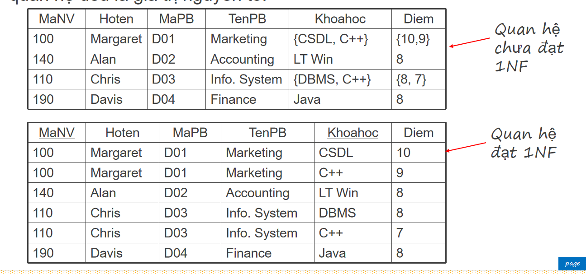
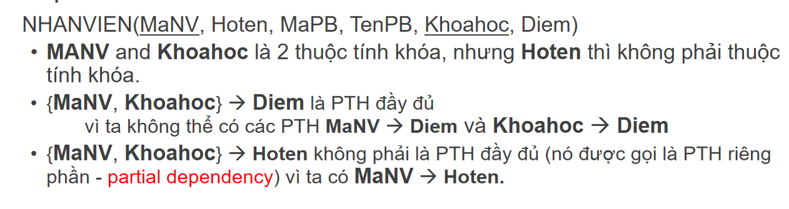
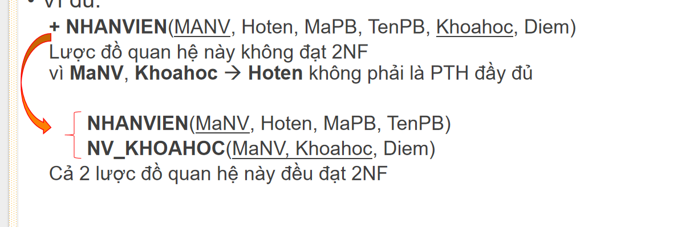
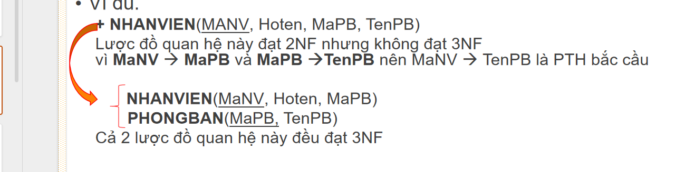

1. Some Terminology about db

   - Data vs Information
   - Database vs DBMS vs Database System
   - Metadata
   - properties, attributes vs tuple, record
   - super key, candidate key, primary key, foreign key

2. SQL basics

- Query in one table

  - Projection vs Selection
  - Comparison operators
    - LIKE and NOT LIKE
    - BETWEEN min_value AND max_value
  - Grouping and Aggregation
    - COUNT, SUM, AVG, MIN, MAX
    - GROUP BY
    - HAVING
    - Ordering: ORDER BY
  - Filtering & Sorting: WHERE, ORDER BY, LIMIT
  - Order of clauses in a query vs order of execution

- Query in multiple tables
  - Joins: INNER JOIN, LEFT JOIN, RIGHT JOIN, FULL JOIN
  - Subqueries & CTEs: WITH clause, nested SELECT
    - Comparison operators with Subqueries
      - All, ANY
      - EXISTS, NOT EXISTS
      - IN, NOT IN

3. Schema Design & Normalization

- Primary keys, foreign keys, constraints in Database
- Relationships: one-to-one, one-to-many, many-to-many
- Normalization: 1NF, 2NF, 3NF, BCNF

  - 1NF: Every column should have atomic values
    
  - 2NF: 1NF + No partial dependency
    
    
  - 3NF: 2NF + No transitive dependency
    

- Indexes: What, when and how?

4. Transactions & Concurrency

- ACID properties
- Transactions: BEGIN, COMMIT, ROLLBACK
- Isolation levels: READ UNCOMMITTED, READ COMMITTED, REPEATABLE READ, SERIALIZABLE

5. Backend Integration

JDBC / JPA / Hibernate Basics
Using Connection Pools
N+1 Query Problem & How to Avoid It
Database Migration Tools (Liquibase/Flyway)
