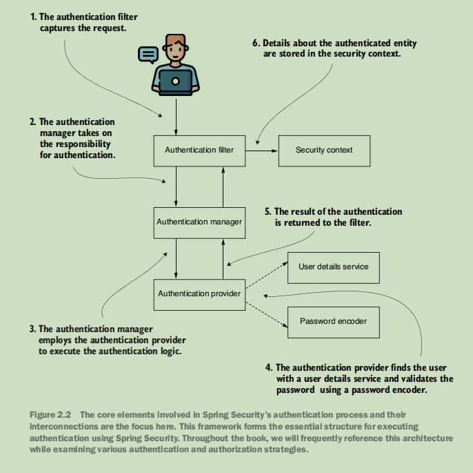

1. How authentication flow work
   

2. Authentication flow in Spring Security
   - UserDetailsService: loadUserByUsername(String username) -> UserDetails
   - PasswordEncoder: encode(String rawPassword) -> String
   - AuthenticationProvider: authenticate(Authentication authentication) -> Authentication
   - When replacing the default UserDetailsService, also replace the default PasswordEncoder
     2.1. UserDetailService
     

2.2. PasswordEncoder

2.1.1. Basic uses

- encode(rawPassword) - Hashes a raw password
- matches(rawPassword, encodedPassword) - Verifies if a raw password matches a hashed one.

  2.2.2. BCryptPasswordEncoder

- BCryptPasswordEncoder is a PasswordEncoder implementation that uses the BCrypt hashing algorithm to hash passwords.

```java
@Bean
    PasswordEncoder passwordEncoder(){
        return new BCryptPasswordEncoder();
    }
```

2.2.3. Example using

```java
// When a user registers or changes password
String encodedPassword = passwordEncoder.encode("rawPassword");
user.setPassword(encodedPassword);
```

```java
// In your custom authentication provider or when validating passwords
boolean isMatch = passwordEncoder.matches(rawPasswordFromLogin, encodedPasswordFromDatabase);
```

2.3. Filter chain

2.3.1. Basic uses

- Filter chain is a series of filters that process requests and responses in a web application.
- Each filter in the chain can perform specific tasks, such as authentication, authorization, logging, and more depending on the filter's purpose.

  2.3.2. How to add filters

- 1 Implement the filter. Implement the `javax.servlet.Filter` interface filter.
- 2 Add the filter to the filter chain. Do this in the configuration class, using the SecurityFilterChain bean.

  2.3.3. Example using

- addFilterBefore(Filter filter, Class<? extends Filter> beforeFilter)
- addFilterAfter(Filter filter, Class<? extends Filter> afterFilter)
- addFilterAt(Filter filter, Class<? extends Filter> atFilter)

```java
//Custom filter
public class CustomFilter extends GenericFilterBean {
    @Override
    public void doFilter(ServletRequest request, ServletResponse response, FilterChain chain) throws IOException, ServletException {
        // Custom filter logic here
        chain.doFilter(request, response); // Continue the filter chain
    }
}
// In your security configuration class
@Override
protected void configure(HttpSecurity http) throws Exception {
    http.addFilterBefore(new CustomFilter(), UsernamePasswordAuthenticationFilter.class);
}
```

OncePerRequestFilter: A filter that ensures that a request is processed only once. It is typically used to perform tasks such as authentication or logging.

```java
public class CustomOncePerRequestFilter extends OncePerRequestFilter {
    @Override
    protected void doFilterInternal(HttpServletRequest request, HttpServletResponse response, FilterChain filterChain) throws ServletException, IOException {
        // Custom filter logic here
        filterChain.doFilter(request, response); // Continue the filter chain
    }
}
```

3. Authorization

- hasRole("ROLE_NAME") or hasAnyRole("ROLE_NAME1", "ROLE_NAME2") -> Checks if the user has a specific role or any of the specified roles.
- hasAuthority("AUTHORITY_NAME") or hasAnyAuthority("AUTHORITY_NAME1", "AUTHORITY_NAME2") -> Checks if the user has a specific authority or any of the specified authorities.
- access("ROLE_NAME") -> Offers unlimited possibilities for configuring access rules.

- access to all endpoints -> permitAll(), denyAll(), authenticated()

- requestMatchers() -> Matches specific request patterns (e.g., URL paths, HTTP methods) to apply security rules.
- requestMatchers("/admin/\*\*").hasRole("ADMIN") -> Only users with the "ADMIN" role can access URLs starting with "/admin/".
- requestMatchers(HttpMethod.POST, "/api/\*\*").hasAuthority("ROLE_USER") -> Only users with the "ROLE_USER" authority can access POST requests to URLs starting with "/api/".

  3.1. Method security

- Enables method-level security annotations in Spring applications.
- It allows you to secure methods in your service or controller classes using annotations like @PreAuthorize, @PostAuthorize, @Secured, and @RolesAllowed.

```java
@Configuration
@EnableMethodSecurity
public class ProjectConfig {
}

```

```java
@PreAuthorize("hasAuthority('write')")
 public String getName() {
 return "Fantastico";
 }

@PreAuthorize("hasRole('USER')")
  public String getName2() {
  return "Fantastico2";
  }

//get id from user context
@PreAuthorize("#id == authentication.principal.id")
public String getName3(Long id) {
    return "Fantastico3";
}


```
