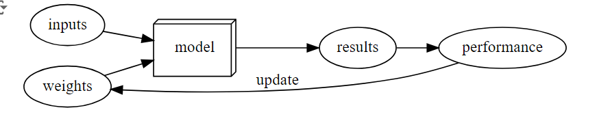

# Lesson 1

  
1. Why it was nearly impossible to detect bird before 2015

  beacause it many feature of bird and connected by hand for machine learning is nearly 10x time-comsuming
  => deep learning is the solution, which could see the feature of bird and connected by itself

  
2. What is machine learning

  
3. What is neutral network

