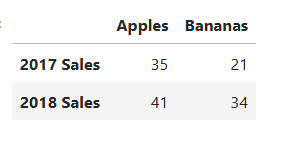
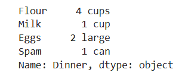

# Pandas

## Read file

### Create dataframe

- two-dimensional data structure with rows and columns, each column is a Series

Like json format but value in array []



```python
fruit_sales = pd.DataFrame({"Apples" : [35, 41], "Bananas" : [21, 34]}, index = ["2017 Sales", "2018 Sales"])

```

### series

- is single colume or single row



```python

ingredients = pd.Series(["4 cups", "1 cup", "2 large", "1 can"], index = ["Flour", "Milk", "Eggs", "Spam"], name = "Dinner" )

```

### Read file

```python
# Path of the file to read
iowa_file_path = '../input/home-data-for-ml-course/train.csv'

home_data = pd.read_csv(iowa_file_path)
# Create target object and call it y
y = home_data.SalePrice
# Create X
features = ['LotArea', 'YearBuilt', '1stFlrSF', '2ndFlrSF', 'FullBath', 'BedroomAbvGr', 'TotRmsAbvGrd']
X = home_data[features]

```

### Save to csv

```python
animals.to_csv("cows_and_goats.csv")
```

# Scikit-learn

```python
# Split into validation and training data
train_X, val_X, train_y, val_y = train_test_split(X, y, random_state=1)

# Specify Model
iowa_model = DecisionTreeRegressor(random_state=1)
# Fit Model
iowa_model.fit(train_X, train_y)

# Make validation predictions and calculate mean absolute error
val_predictions = iowa_model.predict(val_X)
val_mae = mean_absolute_error(val_predictions, val_y)

```
