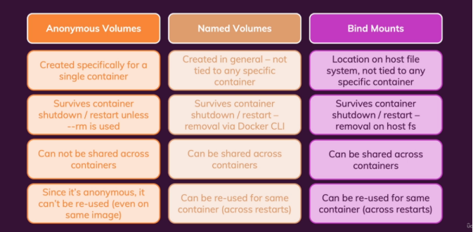

# Table of Contents

- [Basic Definition](#basic-definition)
  - [Containers](#containers)
  - [Image](#image)
  - [Registry vs Repository](#registry-vs-repository)
  - [Docker Compose](#docker-compose)
- [Building Images](#building-images)
  - [Dockerfile](#dockerfile)
  - [Docker Build](#docker-build)
- [Docker command](#docker-command)
  - [Image And Container](#image-and-container)

# Basic Definition

Docker is a tool that makes it easier to create, deploy, and run applications using containers.

## Containers

Containers are small, fast, and portable packages of software that include everything needed to run an application.

## Image

An image is a snapshot of a container that includes the application and all its dependencies.

## Registry vs Repository

A registry is a place where Docker images are stored. A repository is a collection of related images.

## Docker Compose

Docker Compose is a tool that helps you run multiple containers at once using a simple configuration file.

# Building images

## Understanding the image layers

Docker images are made up of layers, each representing a set of file changes or instructions in the Dockerfile. Understanding these layers can help optimize image builds and manage storage.
Just like you install an os like ubuntu, then it one layer, then u install nodejs, then it another layer and run on top of os

## Writing a Dockerfile

A Dockerfile is a script containing a series of instructions on how to build a Docker image. It specifies the base image, application code, dependencies, and commands to run.

### Common Instructions in a Dockerfile

Here are some of the most common instructions used in a Dockerfile:

- **`FROM <image>`**: Specifies the base image that the build will extend.
- **`WORKDIR <path>`**: Sets the working directory in the image where files will be copied and commands will be executed.
- **`COPY <host-path> <image-path>`**: Copies files from the host to the container image.
- **`RUN <command>`**: Executes a command during the build process.
- **`ENV <name> <value>`**: Sets an environment variable that a running container will use.
- **`EXPOSE <port-number>`**: Indicates a port that the image would like to expose.
- **`USER <user-or-uid>`**: Sets the default user for all subsequent instructions.
- **`CMD ["<command>", "<arg1>"]`**: Sets the default command that a container using this image will run.

## Build, tag, and publish an image

Building an image involves executing the instructions in a Dockerfile. Once built, you can tag the image with a meaningful name and version, and then publish it to a Docker registry for distribution.

```
docker build -t my-username/my-image .
```

```
docker image tag my-username/my-image another-username/another-image:v1
```

```
docker push my-username/my-image
```

## Using the build cache

Docker uses a build cache to speed up the image building process by reusing layers from previous builds. Efficient use of the build cache can significantly reduce build times.

## Multi-stage builds

Multi-stage builds allow you to use multiple FROM statements in a Dockerfile to create intermediate images. This technique helps in reducing the final image size by copying only the necessary artifacts from intermediate stages.

# Docker command

## Image And Container

```
docker build -t {name}:{version} .
```

```
docker run -d --rm --name {name of container} -p 80:80 {name of images}
```

```
docker stop {name or id}
```

```
docker start {name of existed container}
```

```
docker rm {name of container}
```

```
docker rmi {name of images}
```

```
docker ps -a
```

```
docker images
```

## Docker Volume Management



Docker volumes come in three main types: **Named Volumes**, **Anonymous Volumes**, and **Bind Mounts**. Each serves a unique purpose in container data persistence and file management between host and container.

### Volume Types and Usage

#### 1. Named Volume

Used for persistent data management by Docker. Named volumes are ideal for data that should survive container restarts and upgrades.

```bash
docker run -v data:/app/data

```

#### 2. Anonymous Volume

Protects specific paths in the container from being overwritten by the host. Useful when you want Docker to manage the path without linking it to a specific host directory.

```bash
docker run -v /app/data

```

** Example: **

Without anonymous volumes, some paths may be wiped out. With anonymous volumes, the container can maintain directories like node_modules which might otherwise be deleted.

```
Without anonymous volume:
Local Directory      Container
my-app/              /app/
  ├── src/     →       ├── src/
  ├── package.json →   ├── package.json
  └── (no modules)  →  └── (modules get wiped out!)

With anonymous volume:
Local Directory      Container
my-app/              /app/
  ├── src/     →       ├── src/
  ├── package.json →   ├── package.json
  └── (no modules)     └── node_modules/ (preserved!)

```

#### 3. Bind Mount

Allows direct file sharing between the host and container. It’s particularly useful for development as changes on the host are reflected in the container immediately.

```bash
docker run -v "%cd%:/app"
# or specify an absolute path
docker run -v /path/to/code:/app
```

#### 4. Example: Create Volumes with All Types

```
docker run -d --rm -p 3000:80 --name docker-app \
  -v feedback:/app/feedback \   # Named volume
  -v "%cd%:/app" \              # Bind mount
  -v /app/node_modules \         # Anonymous volume
  docker-app:volumes

```
