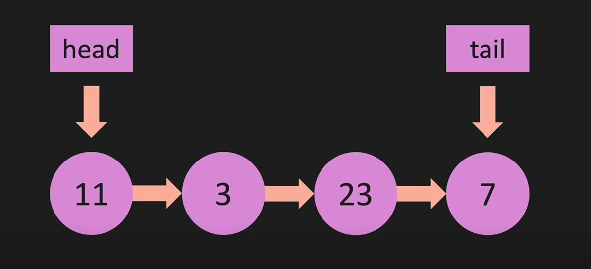
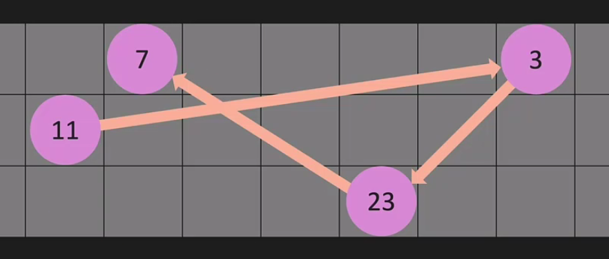
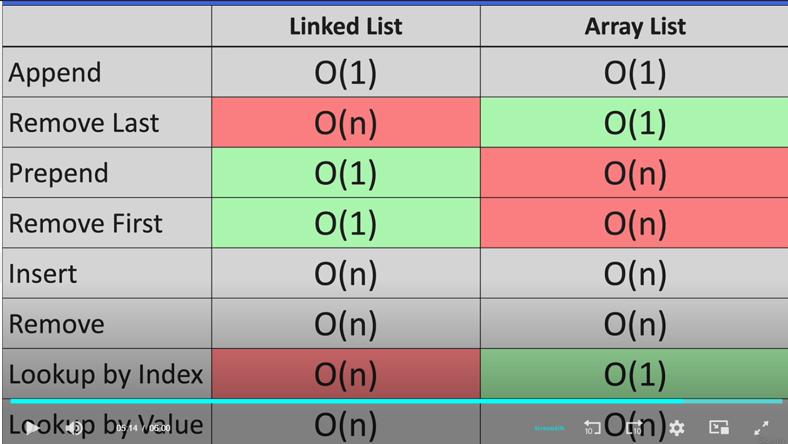

## Big O

### Time Complexity

    - Not measured in seconds, but in growth of number of operations.
    - O(1) > O(log n) > O(n) > O(n log n) > O(n^2)
    - Include
        - Omeg(Ω) - Lower Bound, best case
        - Theta(Θ) - Average, average case
        - O - Upper Bound, worst case
    - Drop constants: O(2n) = O(n)
    - Drop non-dominant terms: O(n^2 + n) = O(n^2)
    - Different inputs: O(n + m)
    - Big 0 of Array: O(1) - Access, O(n) - Search, O(n) - Insert, O(n) - Delete

## Linked List

### General Idea

### Big O

### How it works

#### Structure

    - Node
        - Data or Value
        - Pointer to Next Node
