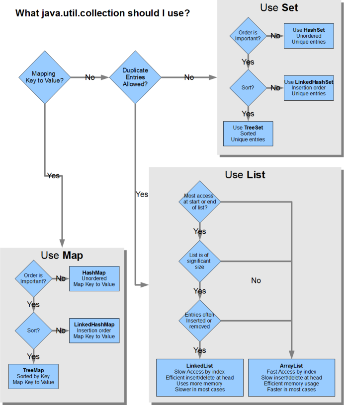

# Java Core Concepts for Fresher Interviews

## Table of Contents

- [OOP Fundamentals](#oop-fundamentals)
- [Java Basics](#java-basics)
- [Collections Framework](#collections-framework)
- [Exception Handling](#exception-handling)
- [Multithreading](#multithreading)
- [Additional Topics](#additional-topics)

## OOP Fundamentals

- [**Classes and Objects**](#classes-and-objects)
- [**Inheritance**](#inheritance)
- [**Polymorphism**](#polymorphism)
- [**Encapsulation**](#encapsulation)
- [**Abstraction**](#abstraction)

### **Classes and Objects**

- Class is blueprint, Object is instance
- Constructor initializes object
- Objects have state and behavior

```java

// Class - Blueprint
public class Student {
    // State (attributes)
    private String name;
    private int age;
    private String grade;

    // Constructor
    public Student(String name, int age) {
        this.name = name;
        this.age = age;
    }

    // Default constructor
    public Student() {
        this.name = "Unknown";
        this.age = 0;
    }

    // Behavior (methods)
    public void study() {
        System.out.println(name + " is studying");
    }
}

// Creating Objects (Instances)
Student student1 = new Student("John", 20);
Student student2 = new Student();
```

### **Inheritance**

- Reuse code
- 'extends' keyword
- Types: Single, Multilevel, Hierarchical
- Java doesn't support multiple inheritance

```java

// Single Inheritance
class Animal {
    void eat() { }
}
class Dog extends Animal { }  // Single

// Multilevel Inheritance
class Animal {
    void eat() { }
}
class Dog extends Animal { }
class Labrador extends Dog { } // Multilevel

// Hierarchical Inheritance
class Animal {
    void eat() { }
}
class Dog extends Animal { }
class Cat extends Animal { }   // Hierarchical

// Multiple Inheritance (Not Supported in Java)
class Dog extends Animal, Pet { } // NOT ALLOWED
// Instead use interfaces
interface Animal { }
interface Pet { }
class Dog implements Animal, Pet { } // This is allowed

```

### **Polymorphism**

- Method Overriding (Runtime)
- Method Overloading (Compile-time)
- Same interface, different implementations

```java

// Method Overriding (Runtime Polymorphism)
class Animal {
    public void makeSound() {
        System.out.println("Some sound");
    }
}

class Dog extends Animal {
    @Override
    public void makeSound() {
        System.out.println("Woof");
    }
}

// Method Overloading (Compile-time Polymorphism)
class Calculator {
    int add(int a, int b) {
        return a + b;
    }

    double add(double a, double b) {
        return a + b;
    }

    int add(int a, int b, int c) {
        return a + b + c;
    }
}

```

### **Encapsulation**

- Data hiding
- Private fields, public methods
- Getter/Setter methods
- Validates data access

```java

public class Employee {
    // Private fields (data hiding)
    private String name;
    private double salary;

    // Public getters/setters (controlled access)
    public String getName() {
        return name;
    }

    public void setSalary(double salary) {
        if (salary > 0) {  // Data validation
            this.salary = salary;
        } else {
            throw new IllegalArgumentException("Salary must be positive");
        }
    }

    // Business logic methods
    public void giveRaise(double percentage) {
        if (percentage > 0 && percentage <= 100) {
            this.salary += this.salary * (percentage/100);
        }
    }
}

```

### **Abstraction**

- Hide implementation details
- Abstract classes vs Interfaces
- Focus on essential features
- Reduce complexity

```java

// Abstract class
abstract class Vehicle {
    abstract void start();  // Abstract method

    // Concrete method
    void stop() {
        System.out.println("Vehicle stopping");
    }
}

// Interface
interface Flyable {
    void fly();
    void land();
}

// Concrete implementation
class Airplane extends Vehicle implements Flyable {
    @Override
    void start() {
        System.out.println("Airplane starting engines");
    }

    @Override
    public void fly() {
        System.out.println("Airplane taking off");
    }

    @Override
    public void land() {
        System.out.println("Airplane landing");
    }
}
```

## Java Basics

- [**Data Types & Variables**](#data-types--variables)
- [**Control Statements**](#control-statements)
- [**Arrays**](#arrays)
- [**String handling**](#string-handling)
- [**Access modifiers**](#access-modifiers)

### **Data Types & Variables**

- **Primitive data types**: byte, short, int, long, float, double, char, boolean
- **Reference data types**: String, Array, Class, Interface

```java
  // Primitive Types
byte b = 127;                  // 8-bit
short s = 32767;              // 16-bit
int i = 2147483647;           // 32-bit
long l = 9223372036854775807L;// 64-bit
float f = 3.14f;              // 32-bit floating point
double d = 3.14159;           // 64-bit floating point
boolean bool = true;          // true/false
char c = 'A';                 // 16-bit Unicode character

// Reference Types
String str = "Hello";
Integer wrapper = 42;         // Wrapper class
```

### **Control Statements**

```java
  // If-else
if (condition) {
    // code
} else if (another_condition) {
    // code
} else {
    // code
}

// Switch
switch (variable) {
    case 1:
        // code
        break;
    default:
        // code
}

// Loops
for (int i = 0; i < 10; i++) {
    // code
}

while (condition) {
    // code
}

do {
    // code
} while (condition);

// Enhanced for loop
for (String item : collection) {
    // code
}
```

### **Arrays**

```java
// Array Declaration
int[] numbers = new int[5];
int[] initialized = {1, 2, 3, 4, 5};

// 2D Array
int[][] matrix = new int[3][3];
int[][] initialized2D = {{1,2}, {3,4}};

// Array operations
numbers[0] = 1;              // Assignment
int length = numbers.length; // Length
Arrays.sort(numbers);        // Sorting

```

### **String handling**

```java
// String creation
String s1 = "Hello";                 // String literal
String s2 = new String("Hello");     // String object

// Common operations
String concat = s1 + " World";       // Concatenation
int length = s1.length();            // Length
char ch = s1.charAt(0);              // Character at index
String sub = s1.substring(0, 3);     // Substring
boolean equals = s1.equals(s2);      // Comparison
String lower = s1.toLowerCase();      // Case conversion

// StringBuilder (mutable)
StringBuilder sb = new StringBuilder();
sb.append("Hello");
sb.append(" World");
String result = sb.toString();
```

- **String vs StringBuilder vs StringBuffer**

  - **String**: Immutable, thread-safe, slow performance.
  - **StringBuilder**: Mutable, not thread-safe, fast performance.
  - **StringBuffer**: Mutable, thread-safe, slow performance.

  - String Pool: A pool of unique strings stored in the heap memory.

```java
// String Pool demonstration
String s1 = "hello";           // creates in string pool
String s2 = "hello";           // reuses from pool
String s3 = new String("hello");// creates new object outside pool

System.out.println(s1 == s2);      // true (same reference)
System.out.println(s1 == s3);      // false (different reference)
System.out.println(s1.equals(s3)); // true (same content)

```

### **Access modifiers**

- **Public**: Accessible from any class.
- **Protected**: Accessible within the same package and subclasses.
- **Default (no modifier)**: Accessible within the same package.
- **Private**: Accessible only within the same class.

- public > protected > default > private

## Collections Framework

- **Hierarchy and Relationships**
- **When to Use Which Collection**
- **Common Methods of collection**
- **Comparable vs Comparator**
- **Thread-safe Collections**
- **Specialized Collections: Stack, Queue, Deque, Vector**
- **Immutable Collections**

  

- **Common Methods of collection**

- Collection-general Methods

```java
  add(E e): Adds an element to the collection.
  remove(Object o): Removes a specific element.
  size(): Returns the size of the collection.
  isEmpty(): Checks if the collection is empty.
  contains(Object o): Checks if the collection contains a specific element.
  clear(): Removes all elements from the collection.
  iterator(): Returns an iterator to traverse the collection.
```

- List-Specific Methods

```java
add(int index, E element): Inserts an element at a specific index.

get(int index): Retrieves the element at a specific index.

set(int index, E element): Updates the element at a specific index.

remove(int index): Removes the element at a specific index.

indexOf(Object o): Returns the first occurrence of an element.

lastIndexOf(Object o): Returns the last occurrence of an element.

subList(int fromIndex, int toIndex): Returns a view of the specified range.
```

- Set - Specific Methods

```java
add(E e): Adds an element (ignores duplicates).
```

- Map - Specific Methods

```java

put(K key, V value): Associates a key with a value.

get(Object key): Retrieves a value by its key.

remove(Object key): Removes a key-value pair.

containsKey(Object key): Checks if a key exists.

containsValue(Object value): Checks if a value exists.

keySet(): Returns a set of keys.

values(): Returns a collection of values.

entrySet(): Returns a set of key-value pairs.

```

## Exception Handling

- **try-catch blocks**
  - **Purpose**: Handle exceptions (runtime errors) to prevent program termination.
  - **Syntax**:
    ```java
    try {
        // code that may throw exception
    } catch (ExceptionType1 e1) {
        // Handle ExceptionType1
    } catch (ExceptionType2 e2) {
        // Handle ExceptionType2
    } finally {
        // Code that will always execute, regardless of an exception
    }
    ```
  - **Important**: Always use specific exceptions in catch blocks before more general ones.
- **throws vs throw**

  - **throws**: Used in method signature to declare that the method may throw an exception.

  ```java
  public void myMethod() throws IOException, SQLException {
  // Method code
  }
  ```

  - **throw**: Used to throw an exception explicitly.

  ```java
  if (someCondition) {
    throw new IllegalArgumentException("Invalid argument");
  }
  ```

- **Checked vs Unchecked exceptions**
  - **Checked**: - Must be either caught or declared in the method signature using throws. - Examples: IOException, SQLException.
  - **Unchecked**: - Compiler does not check if the code handles these exceptions. - Examples: NullPointerException, ArrayIndexOutOfBoundsException.
- **Custom exceptions**

  - **Purpose**: Create custom exceptions to handle specific errors in your application.
  - **Steps**:

    1.  Create a new class that extends `Exception` (for checked exceptions) or `RuntimeException` (for unchecked exceptions).
    2.  Add a constructor that accepts a message.
    3.  Use the `super` keyword to call the parent class constructor.

  ```java
    public class MyCustomException extends Exception {
        public MyCustomException(String message) {
            super(message);
        }

        public MyCustomException(String message, Throwable cause) {
            super(message, cause);
        }
    }

  ```

  - ** in spring boot **
    - **@ControllerAdvice**: Used to define global exception handlers for all controllers.
    - **@ExceptionHandler**: Used to define methods that handle specific exceptions.

  ```java
  @ControllerAdvice
    public class GlobalExceptionHandler {

        @ExceptionHandler(MyCustomException.class)
        public ResponseEntity<String> handleMyCustomException(MyCustomException ex) {
            return new ResponseEntity<>(ex.getMessage(), HttpStatus.BAD_REQUEST);
        }

        // Handle other exceptions
        @ExceptionHandler(Exception.class)
        public ResponseEntity<String> handleException(Exception ex) {
            return new ResponseEntity<>(ex.getMessage(), HttpStatus.INTERNAL_SERVER_ERROR);
        }
    }
  ```

## Multithreading

- **Thread lifecycle**

```java
New --> Runnable --> Running --> (Blocked / Waiting / Timed Waiting) --> Runnable --> Terminated
```

- **Creating threads**
  There 2 ways to create a thread in Java:

  - **Extending the Thread class**

    ```java
    class MyThread extends Thread {
        public void run() {
            System.out.println("Thread is running");
        }
    }

    public class Main {
        public static void main(String[] args) {
            MyThread thread = new MyThread();
            thread.start();
        }
    }
    ```

  - **Implementing the Runnable interface**

    ```java
    class MyRunnable implements Runnable {
        public void run() {
            /System.out.println("Thread is running");
        }
    }

    public class Main {
        public static void main(String[] args) {
            MyRunnable runnable = new MyRunnable();
            Thread thread = new Thread(runnable);
            thread.start();
        }
    }
    ```

- **Synchronization**
  Synchronization is used to control the access of multiple threads to shared resources. It helps prevent thread interference and memory consistency errors.

  - **Synchronized methods**
    ```java
    public synchronized void myMethod() {
        // Synchronized code
    }
    ```
  - **Synchronized blocks**

    ```java
    public void myMethod() {
        synchronized (this) {
            // Synchronized code
        }
    }
    ```

    ```java
    public class Counter {
      private int count = 0;
      private final Object lock = new Object(); // Lock object for synchronization

      // Synchronized block
      public void increment() {
          synchronized (lock) {
              count++;
          }
      }

      public int getCount() {
          return count;
      }
    }
    ```

- **Thread states**
  - **NEW** : The thread is created but not yet started.
  - **RUNNABLE**: The thread is ready to run and waiting for CPU time.
  - **BLOCKED**: The thread is blocked and waiting for a monitor lock.
  - **WAITING**: The thread is waiting indefinitely for another thread to perform a particular action.
  - **TIMED_WAITING**: The thread is waiting for another thread to perform an action for up to a specified waiting time.
  - **TERMINATED**: The thread has completed its execution.
    
- **wait(), notify(), notifyAll()**

  - These methods are used for inter-thread communication and must be called within a synchronized context.

- wait(): Causes the current thread to wait until another thread invokes notify() or notifyAll() on the same object.

```java
synchronized (lock) {
  lock.wait();
}
```

- notify(): Wakes up a single thread that is waiting on this object.

```java
synchronized (lock) {
  lock.notify();
}
```

- notifyAll(): Wakes up all threads that are waiting on this object.

```java
synchronized (lock) {
  lock.notifyAll();
}
```

- Examples

```java
public class WaitNotifyExample {
  private static final Object lock = new Object();

  public static void main(String[] args) {
      Thread thread1 = new Thread(() -> {
          synchronized (lock) {
              try {
                  System.out.println("Thread 1 waiting");
                  lock.wait();
                  System.out.println("Thread 1 resumed");
              } catch (InterruptedException e) {
                  e.printStackTrace();
              }
          }
      });

      Thread thread2 = new Thread(() -> {
          synchronized (lock) {
              System.out.println("Thread 2 notifying");
              lock.notify();
          }
      });

      thread1.start();
      try {
          Thread.sleep(1000); // Ensure thread1 starts and waits
      } catch (InterruptedException e) {
          e.printStackTrace();
      }
      thread2.start();
  }
}
```

## Additional Topics

- **Java 8 features (Lambda, Stream API, etc)**
- **Memory management (Stack vs Heap)**
- **Final, Finally, Finalize**
- **Interface vs Abstract class**
- **Constructor types**
- **Method overloading vs overriding**

- **Java 8 features (Lambda, Stream API, etc)**

1. **Lambda Expressions**: Lambda expressions are used to provide an implementation of a functional interface. They are used to write more concise and readable code.

- More readable code
- Functional programming support
- Enable parallel processing

```java
// Before Java 8
Runnable runnable = new Runnable() {
    @Override
    public void run() {
        System.out.println("Old way");
    }
};

// With Lambda
Runnable runnable = () -> System.out.println("Lambda way");

// Common Lambda Examples
List<String> names = Arrays.asList("John", "Jane", "Bob");
names.forEach(name -> System.out.println(name));
Collections.sort(names, (a, b) -> a.compareTo(b));

```

2. **Stream API**: The Stream API is used to process collections of objects. It provides a functional programming approach to processing data.

- Chain operations
- Parallel processing
- Declarative programming

```java
List<Integer> numbers = Arrays.asList(1, 2, 3, 4, 5, 6);

// Filter, Map, Reduce operations
numbers.stream()
       .filter(n -> n % 2 == 0)     // get even numbers
       .map(n -> n * n)             // square them
       .forEach(System.out::println);

// Common Stream operations
// 1. Filtering
List<Integer> evenNumbers = numbers.stream()
    .filter(n -> n % 2 == 0)
    .collect(Collectors.toList());

// 2. Mapping
List<String> mapped = numbers.stream()
    .map(n -> "Number: " + n)
    .collect(Collectors.toList());

// 3. Sorting
List<String> sorted = names.stream()
    .sorted()
    .collect(Collectors.toList());

// 4. Statistics
int sum = numbers.stream()
    .mapToInt(Integer::intValue)
    .sum();

// 5. Grouping
Map<Integer, List<Integer>> grouped = numbers.stream()
    .collect(Collectors.groupingBy(n -> n % 2));

```

3. **Optional**: Optional is a container object that may or may not contain a non-null value. It is used to avoid NullPointerExceptions.

- Better null handling
- More readable code
- Avoid NullPointerException

```java
// Avoiding null checks
Optional<String> optional = Optional.of("hello");
optional.ifPresent(s -> System.out.println(s));

// Chain operations
String result = optional
    .map(String::toUpperCase)
    .orElse("default");
```

4. **Default Methods**: Default methods allow interfaces to have methods with implementation. They provide a way to add new methods to interfaces without breaking existing implementations.

- Interface evolution
- Backward compatibility
- Multiple inheritance of behavior

```java
interface Vehicle {
    // Abstract method
    void start();

    // Default method
    default void horn() {
        System.out.println("Beep!");
    }
}
```

5. **Functional Interfaces**: Functional interfaces have exactly one abstract method. They can have multiple default or static methods.

6. **Method References**: Method references provide a way to refer to methods or constructors without invoking them.

- Cleaner syntax
- Four types: static, instance, constructor, arbitrary object

```java
List<String> names = Arrays.asList("John", "Jane", "Bob");

// Different types of method references
names.forEach(System.out::println);  // Static
names.stream()
     .map(String::toUpperCase)       // Instance
     .collect(Collectors.toList());
```

- **Memory management (Stack vs Heap)**

  - **Stack**: Where method invocations and local variables live
  - Local variables are declared inside a method, including
    method parameters
  - **Heap**: Where **ALL** objects live
  - Instance variables are declared inside a class but not
    inside a method => live in the heap as it in object and object live in heap

- **Final, Finally, Finalize**
- **Interface vs Abstract class**
- **Constructor types**
- **Method overloading vs overriding**
