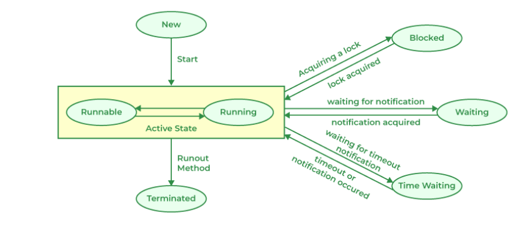

# Java Core Concepts for Fresher Interviews

## Table of Contents

- [OOP Fundamentals](#oop-fundamentals)
- [Java Basics](#java-basics)
- [Collections Framework](#collections-framework)
- [Exception Handling](#exception-handling)
- [Multithreading](#multithreading)
- [Code Examples](#code-examples)
- [Additional Topics](#additional-topics)

## OOP Fundamentals

- **Classes and Objects**
- **Inheritance**
- **Polymorphism**
- **Encapsulation**
- **Abstraction**

## Java Basics

- **Data Types & Variables**
- **Control Statements**
- **Arrays**
- **String handling**
- **Access modifiers**

## Collections Framework

- **List, Set, Map interfaces**
- **ArrayList, LinkedList**
- **HashSet, TreeSet**
- **HashMap, TreeMap**
- **Comparable vs Comparator**

## Exception Handling

- **try-catch blocks**
  - **Purpose**: Handle exceptions (runtime errors) to prevent program termination.
  - **Syntax**:
    ```java
    try {
        // code that may throw exception
    } catch (ExceptionType1 e1) {
        // Handle ExceptionType1
    } catch (ExceptionType2 e2) {
        // Handle ExceptionType2
    } finally {
        // Code that will always execute, regardless of an exception
    }
    ```
  - **Important**: Always use specific exceptions in catch blocks before more general ones.
- **throws vs throw**

  - **throws**: Used in method signature to declare that the method may throw an exception.

  ```java
  public void myMethod() throws IOException, SQLException {
  // Method code
  }
  ```

  - **throw**: Used to throw an exception explicitly.

  ```java
  if (someCondition) {
    throw new IllegalArgumentException("Invalid argument");
  }
  ```

- **Checked vs Unchecked exceptions**
  - **Checked**: - Must be either caught or declared in the method signature using throws. - Examples: IOException, SQLException.
  - **Unchecked**: - Compiler does not check if the code handles these exceptions. - Examples: NullPointerException, ArrayIndexOutOfBoundsException.
- **Custom exceptions**

  - **Purpose**: Create custom exceptions to handle specific errors in your application.
  - **Steps**:

    1.  Create a new class that extends `Exception` (for checked exceptions) or `RuntimeException` (for unchecked exceptions).
    2.  Add a constructor that accepts a message.
    3.  Use the `super` keyword to call the parent class constructor.

  ```java
    public class MyCustomException extends Exception {
        public MyCustomException(String message) {
            super(message);
        }

        public MyCustomException(String message, Throwable cause) {
            super(message, cause);
        }
    }

  ```

## Multithreading

- **Thread lifecycle**

```java
New --> Runnable --> Running --> (Blocked / Waiting / Timed Waiting) --> Runnable --> Terminated
```

- **Creating threads**
  There 2 ways to create a thread in Java:

  - **Extending the Thread class**

    ```java
    class MyThread extends Thread {
        public void run() {
            System.out.println("Thread is running");
        }
    }

    public class Main {
        public static void main(String[] args) {
            MyThread thread = new MyThread();
            thread.start();
        }
    }
    ```

  - **Implementing the Runnable interface**

    ```java
    class MyRunnable implements Runnable {
        public void run() {
            /System.out.println("Thread is running");
        }
    }

    public class Main {
        public static void main(String[] args) {
            MyRunnable runnable = new MyRunnable();
            Thread thread = new Thread(runnable);
            thread.start();
        }
    }
    ```

- **Synchronization**
  Synchronization is used to control the access of multiple threads to shared resources. It helps prevent thread interference and memory consistency errors.
  - **Synchronized methods**
    ```java
    public synchronized void myMethod() {
        // Synchronized code
    }
    ```
  - **Synchronized blocks**
    ```java
    public void myMethod() {
        synchronized (this) {
            // Synchronized code
        }
    }
    ```
- **Thread states**
  - **NEW** : The thread is created but not yet started.
  - **RUNNABLE**: The thread is ready to run and waiting for CPU time.
  - **BLOCKED**: The thread is blocked and waiting for a monitor lock.
  - **WAITING**: The thread is waiting indefinitely for another thread to perform a particular action.
  - **TIMED_WAITING**: The thread is waiting for another thread to perform an action for up to a specified waiting time.
  - **TERMINATED**: The thread has completed its execution.
    
- **wait(), notify(), notifyAll()**

  - These methods are used for inter-thread communication and must be called within a synchronized context.

- wait(): Causes the current thread to wait until another thread invokes notify() or notifyAll() on the same object.

```java
synchronized (lock) {
  lock.wait();
}
```

- notify(): Wakes up a single thread that is waiting on this object.

```java
synchronized (lock) {
  lock.notify();
}
```

- notifyAll(): Wakes up all threads that are waiting on this object.

```java
synchronized (lock) {
  lock.notifyAll();
}
```

- Examples

```java
public class WaitNotifyExample {
  private static final Object lock = new Object();

  public static void main(String[] args) {
      Thread thread1 = new Thread(() -> {
          synchronized (lock) {
              try {
                  System.out.println("Thread 1 waiting");
                  lock.wait();
                  System.out.println("Thread 1 resumed");
              } catch (InterruptedException e) {
                  e.printStackTrace();
              }
          }
      });

      Thread thread2 = new Thread(() -> {
          synchronized (lock) {
              System.out.println("Thread 2 notifying");
              lock.notify();
          }
      });

      thread1.start();
      try {
          Thread.sleep(1000); // Ensure thread1 starts and waits
      } catch (InterruptedException e) {
          e.printStackTrace();
      }
      thread2.start();
  }
}
```

## Additional Topics

- **Java 8 features (Lambda, Stream API)**
- **Memory management (Stack vs Heap)**
- **Final, Finally, Finalize**
- **Interface vs Abstract class**
- **Constructor types**
- **Method overloading vs overriding**
