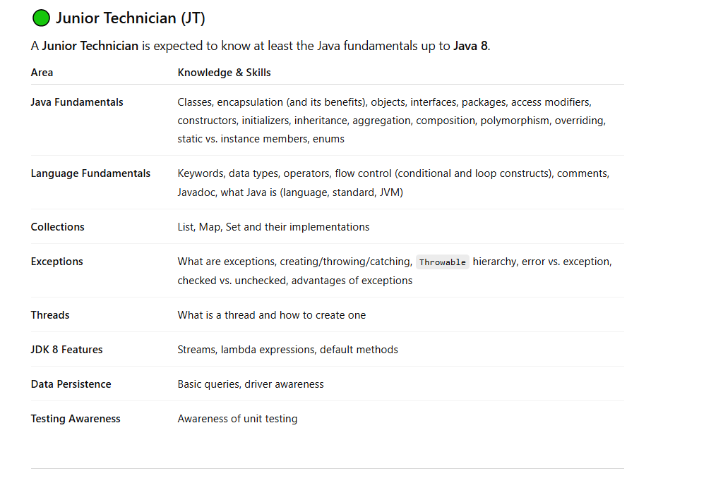
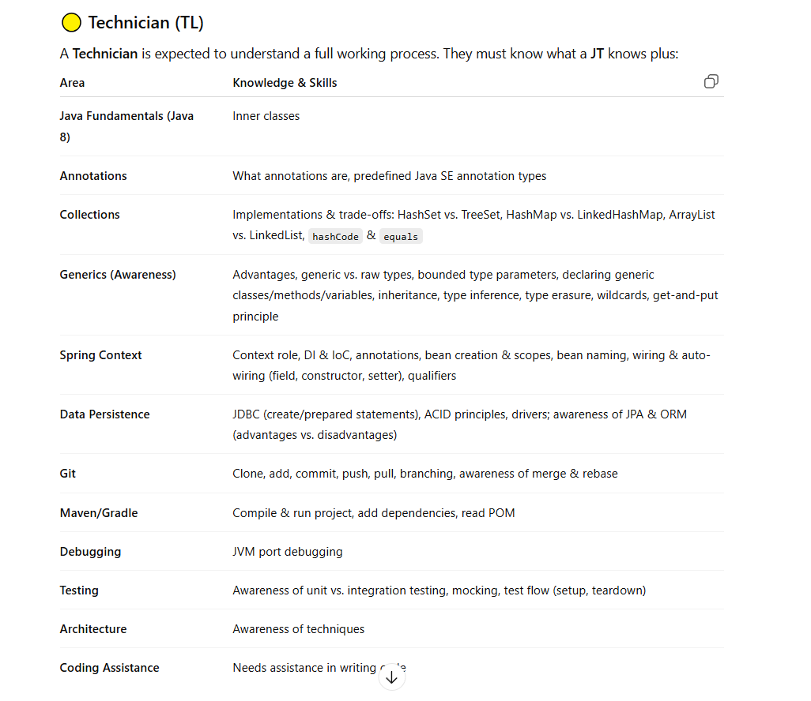
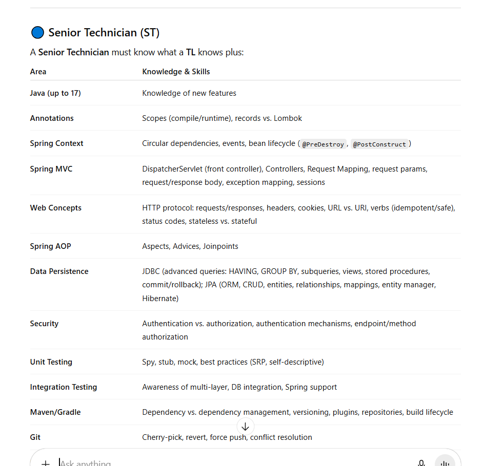
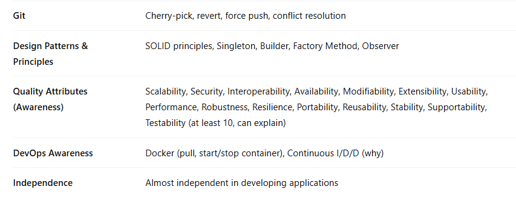

# Comprehensive Java Core Interview Questions

## Section 1: Foundation Layer - Java Language Essentials

### Easy Questions:

1. **What are the 8 primitive data types in Java and their default values?**
2. **What's the difference between `==` and `.equals()` method?**
3. **Explain the difference between `break` and `continue` statements.**

### Medium Questions:

4. **What happens if you don't provide a constructor in your class?**
5. **Explain the difference between `final`, `finally`, and `finalize`.**
6. **What are wrapper classes and why do we need them?**

### Hard Questions:

7. **Explain autoboxing and unboxing with potential performance implications.**
8. **What is the difference between `String`, `StringBuilder`, and `StringBuffer`? When would you use each?**

---

## Section 2: Object-Oriented Programming Fundamentals

### Easy Questions:

9. **What are the four pillars of OOP?**
10. **What's the difference between a class and an object?**
11. **Explain what encapsulation is and provide an example.**

### Medium Questions:

12. **What are access modifiers? Explain each one with examples.**
13. **What's the difference between static and instance variables?**
14. **Can you override a static method? Why or why not?**

### Hard Questions:

15. **Explain the order of execution: static blocks, instance blocks, and constructors.**
16. **What happens if you make a constructor private? Give a real-world use case.**
17. **How does the `this` keyword work, and when would you use `this()` constructor call?**

---

## Section 3: Advanced OOP - Relationships & Behaviors

### Easy Questions:

18. **What's the difference between inheritance and composition?**
19. **What is an interface and how is it different from a class?**
20. **What does polymorphism mean in Java?**

### Medium Questions:

21. **Explain method overriding vs method overloading with examples.**
22. **What is the `super` keyword used for?**
23. **Can an interface extend another interface? Can a class implement multiple interfaces?**

### Hard Questions:

24. **Explain dynamic method dispatch with an example.**
25. **What are abstract classes? When would you use abstract class vs interface?**
26. **A class implements two interfaces with the same method signature. What happens and how do you resolve it?**

---

## Section 4: Collections Framework

### Easy Questions:

27. **What's the difference between List, Set, and Map?**
28. **Name three implementations of List interface.**
29. **What is the difference between ArrayList and LinkedList?**

### Medium Questions:

30. **When would you use HashMap vs TreeMap vs LinkedHashMap?**
31. **What is the difference between HashSet and TreeSet?**
32. **Explain how HashMap works internally.**

### Hard Questions:

33. **What happens when two objects have the same hashCode() but different equals()? Vice versa?**
34. **Explain the load factor in HashMap and what happens during rehashing.**
35. **How would you make a HashMap thread-safe? Compare different approaches.**

---

## Section 5: Exception Handling

### Easy Questions:

36. **What's the difference between checked and unchecked exceptions?**
37. **Name the hierarchy of Exception classes in Java.**
38. **Can you have multiple catch blocks for a single try block?**

### Medium Questions:

39. **What's the difference between `throw` and `throws`?**
40. **Explain the purpose of the `finally` block. Will it always execute?**
41. **What happens if an exception is thrown in a catch block?**

### Hard Questions:

42. **Can you catch Error classes? Should you? Why or why not?**
43. **Explain try-with-resources. What interface must a class implement to be used in try-with-resources?**
44. **What is exception chaining and when would you use it?**

---

## Section 6: Concurrency Basics

### Easy Questions:

45. **What is a thread and how do you create one in Java?**
46. **What's the difference between Thread class and Runnable interface?**
47. **What are the basic states of a thread?**

### Medium Questions:

48. **What is the difference between `wait()` and `sleep()`?**
49. **What does `synchronized` keyword do?**
50. **What is a deadlock and how can you prevent it?**

### Hard Questions:

51. **Explain the difference between `notify()` and `notifyAll()`.**
52. **What is the volatile keyword and when would you use it?**
53. **What are the problems with using `stop()`, `suspend()`, and `resume()` methods?**

---

## Section 7: Modern Java Features (JDK 8+)

### Easy Questions:

54. **What is a lambda expression? Provide a simple example.**
55. **What is a functional interface?**
56. **What are default methods in interfaces?**

### Medium Questions:

57. **Explain the Stream API. What's the difference between intermediate and terminal operations?**
58. **What is method reference? Show different types.**
59. **What is the Optional class and why was it introduced?**

### Hard Questions:

60. **Explain parallel streams. When should you use them and when should you avoid them?**
61. **What are the built-in functional interfaces like Predicate, Function, Consumer, and Supplier?**
62. **How do lambda expressions handle variable capture? What is effectively final?**

---

## Comprehensive Scenario Questions:

### 63. **Design Question (Hard):**

"You need to design a system that manages employees in a company. Each employee has basic info (name, id, salary) but there are different types: Manager, Developer, Intern. Managers have teams, Developers have skills, Interns have mentors. How would you design this using OOP principles? Include considerations for data access, collections usage, and exception handling."

### 64. **Performance Question (Hard):**

"Your application is experiencing memory issues. You notice that you're using lots of Strings, Collections, and creating many temporary objects. How would you identify and fix performance bottlenecks? Consider String handling, Collection choices, object creation patterns, and garbage collection."

### 65. **Integration Question (Hard):**

"You have a legacy system that uses Collections to store data, but now you need to add filtering, transformation, and parallel processing capabilities. How would you integrate Java 8+ features while maintaining backward compatibility? Consider Stream API, lambda expressions, and method references."

---

## Answer Key Structure:

**For each question, prepare to answer:**

1. **Direct answer** - What it is/does
2. **Technical explanation** - How it works internally
3. **Example code** - Concrete demonstration
4. **Use cases** - When to use it
5. **Gotchas/Pitfalls** - Common mistakes
6. **Alternatives** - Other approaches and their trade-offs

---

## Interview Tips:

### **Technical Communication:**

- Always explain WHY, not just WHAT
- Use concrete examples from real projects
- Draw diagrams if helpful (especially for OOP relationships)
- Connect concepts ("This relates to what we discussed about...")

### **Code Examples:**

- Keep them simple but complete
- Explain your thinking process
- Consider edge cases
- Mention potential improvements

### **Depth vs Breadth:**

- Start with high-level overview
- Dive deeper based on interviewer's interest
- Be ready to explain underlying mechanisms
- Connect to real-world scenarios

**Good luck with your interview! 🚀**
